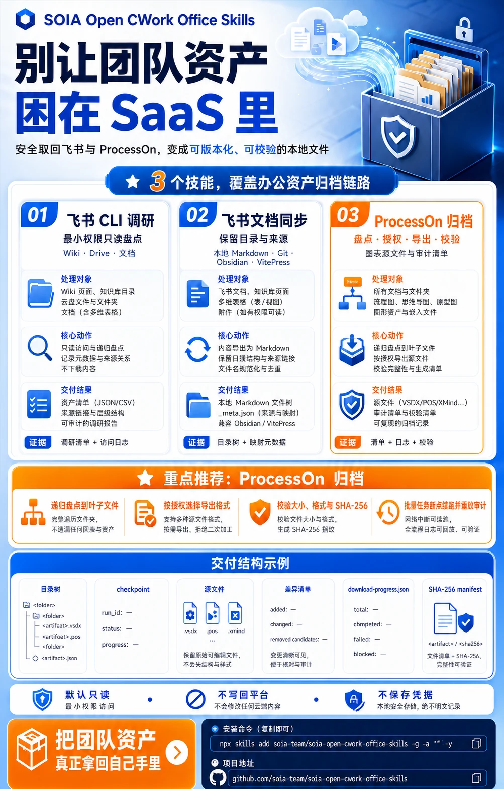
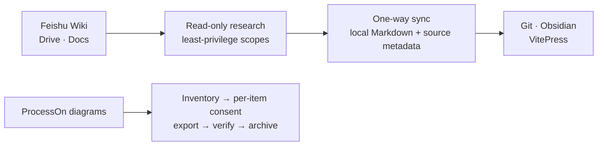

<div align="center">



# SOIA Open CWork Office Skills

**Turn team material locked inside SaaS into local files you can search, edit and commit**

3 skills: read-only Feishu research, knowledge-base sync, ProcessOn diagram archiving. Read-only by default; writes need your authorization

[中文](README.md) · English · [Ecosystem portal](https://github.com/soia-team/soia-open-skills)

</div>

---

## What it solves

Material lives happily inside Feishu and ProcessOn — and **ceases to exist the moment you leave those platforms**. You can't search it, can't commit it, and your agent can't read it. What's missing is a compliant path that turns it into local files.



## 3 skills

### 01 Feishu　`Wiki and cloud docs → reviewable local Markdown`

| Skill | Responsibility | Ready |
|---|---|:-:|
| `soia-cwork-feishu-cli` | Read-only research across Wiki, Drive and docs via the official `lark-cli` with least-privilege scopes | 🟡 |
| `soia-cwork-feishu-doc-git-sync` | **One-way** sync to local Markdown as an app identity, preserving structure, source links and sync metadata | 🟡 |

### 02 Diagrams　`ProcessOn diagrams → an archive whose completeness was verified`

| Skill | Responsibility | Ready |
|---|---|:-:|
| `soia-cwork-processon-diagrams` | Inventories diagrams, exports the ones you authorize item by item, verifies completeness, then archives | 🟡 |

🟡 All three need a platform login or app authorization first; each tells you exactly what is missing before it runs

## Install

Any of three hosts. Installing the domain plugin brings all 3 skills at once.

```bash
claude plugin marketplace add soia-team/soia-open-skills && claude plugin install soia-cwork-office@soia
```

```bash
codex plugin marketplace add soia-team/soia-open-skills && codex plugin add soia-cwork-office@soia
```

WorkBuddy is a desktop app with no CLI, so a skill does the work — tell your agent "install into WorkBuddy", or run:

```bash
python3 <soia-open-skills>/skills/soia-meta-skill-release/scripts/install_workbuddy_experts.py soia-cwork-office
```

Restart the client, then summon **Soia · 办公资料助手** under Experts → My Experts.

> **Always-on cost ~309 tok**, among the lightest domain plugins. `claude plugin disable soia-cwork-office@soia` drops it to zero.
> For a single skill use npx: `npx skills add soia-team/soia-open-cwork-office-skills -g -a '*' -s <skill-name> -y` — pick one route or the other; running both puts the same skill in the index twice and the copies drift apart.

## What it does not do

- **Read-only by default.** Writing, editing or deleting anything on a platform requires authorization **for that specific action** — a prior approval does not carry over.
- **Sync is one-way.** The local copy is a read-only mirror; editing it does not and should not push back.
- **Does not store credentials.** Feishu app credentials and ProcessOn sessions stay with the official flows and with you — never in the repo, the logs, or the synced output.
- **Does not send company material anywhere.** Synced content stays local; nothing is uploaded to third-party services.
- **Does not install environments.** `lark-cli` and browser-automation prerequisites belong to [soia-open-env-skills](https://github.com/soia-team/soia-open-env-skills).

## Contributing

Before committing a skill change:

```bash
python3 -m unittest discover -s tests -p 'test_*.py' && python3 scripts/audit_skills.py --strict && python3 scripts/generate_expert_manifest.py --check
```

Full workflow in the portal's [CONTRIBUTING.md](https://github.com/soia-team/soia-open-skills/blob/main/CONTRIBUTING.md).

## License

MIT — see [LICENSE](./LICENSE).
