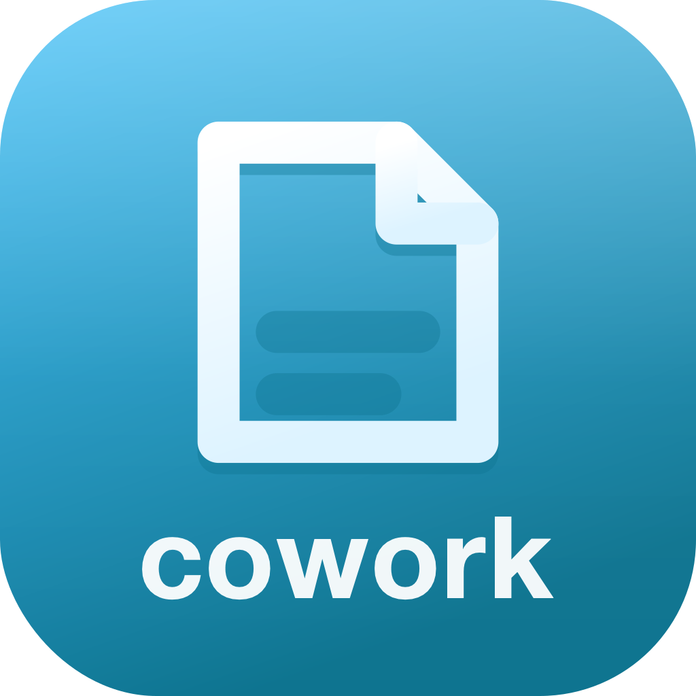
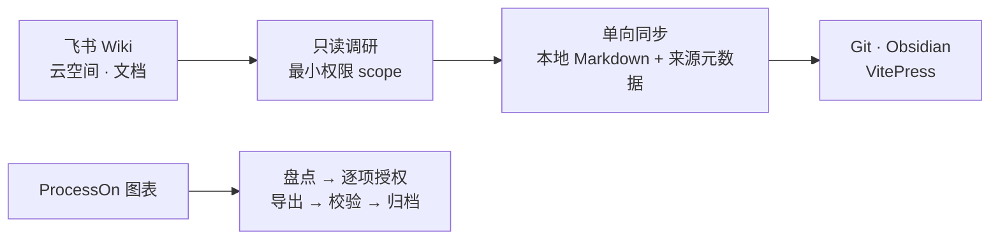

<div align="center">



# SOIA Open CWork Office Skills

**把锁在 SaaS 里的团队资料，变成本地能搜、能改、能进 Git 的文件**

3 个技能：飞书只读调研、知识库同步、ProcessOn 图表归档。默认只读，写操作必须授权

[English](README.en.md) · 中文 · [全生态门户](https://github.com/soia-team/soia-open-skills)

</div>

---

## 它解决什么

资料在飞书和 ProcessOn 里活得很好，**离开那个平台就不存在**——搜不到、进不了 Git、AI 也读不着。缺的是一条把它们变成本地文件的合规通道。



## 3 个技能

### 01 飞书　`Wiki 与云文档 → 可复核的本地 Markdown`

| 技能 | 职责 | 开箱 |
|---|---|:-:|
| `soia-cwork-feishu-cli` | 通过官方 `lark-cli` 以最小权限只读调研 Wiki、Drive 与文档 | 🟡 |
| `soia-cwork-feishu-doc-git-sync` | 以应用身份**单向**同步为本地 Markdown，保留目录、来源与同步元数据 | 🟡 |

### 02 图表　`ProcessOn 图表 → 校验过完整性的归档`

| 技能 | 职责 | 开箱 |
|---|---|:-:|
| `soia-cwork-processon-diagrams` | 盘点图表，按逐项授权导出，校验完整性后归档 | 🟡 |

🟡 三个技能都需先完成对应平台的登录或应用授权，技能会在执行前告诉你缺什么

## 安装

三个宿主任选，装整个领域插件即 3 个技能一次到位。

```bash
claude plugin marketplace add soia-team/soia-open-skills && claude plugin install soia-cwork-office@soia
```

```bash
codex plugin marketplace add soia-team/soia-open-skills && codex plugin add soia-cwork-office@soia
```

WorkBuddy 是桌面端没有 CLI，由技能代劳——对 AI 说「装到 WorkBuddy」，或直接跑：

```bash
python3 <soia-open-skills>/skills/soia-meta-skill-release/scripts/install_workbuddy_experts.py soia-cwork-office
```

装完重启客户端，在【专家中心 → 我的专家】召唤 **Soia · 办公资料助手**。

> **常驻成本 ~309 tok**，全生态最轻的领域插件之一。不用时 `claude plugin disable soia-cwork-office@soia` 降到零。
> 只想要单个技能可走 npx：`npx skills add soia-team/soia-open-cwork-office-skills -g -a '*' -s <技能名> -y`——与插件二选一，并存会产生双份索引且各自漂移。

## 不负责什么

- **默认只读**。写、改、删平台上的内容必须拿到**针对这一次**的明确授权，不因「上次批准过」就默认继续。
- **同步是单向的**。本地是平台的只读副本；改了本地不会也不该被推回去。
- **不保存凭据**。飞书应用凭据、ProcessOn 登录态由官方流程与你自己持有，不进仓库、不进日志、不写进同步产物。
- **不外发公司资料**。同步下来的内容留在本地，不上传第三方服务。
- **不做环境安装**。`lark-cli`、浏览器自动化依赖交给 [soia-open-env-skills](https://github.com/soia-team/soia-open-env-skills)。

## 贡献

改动技能后提交前跑：

```bash
python3 -m unittest discover -s tests -p 'test_*.py' && python3 scripts/audit_skills.py --strict && python3 scripts/generate_expert_manifest.py --check
```

完整流程见门户仓 [CONTRIBUTING.md](https://github.com/soia-team/soia-open-skills/blob/main/CONTRIBUTING.md)。

## License

MIT —— 见 [LICENSE](./LICENSE)。
